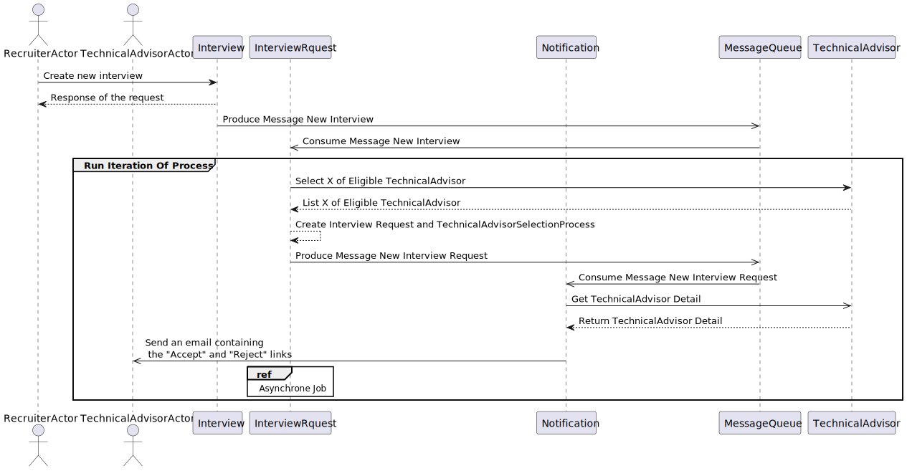
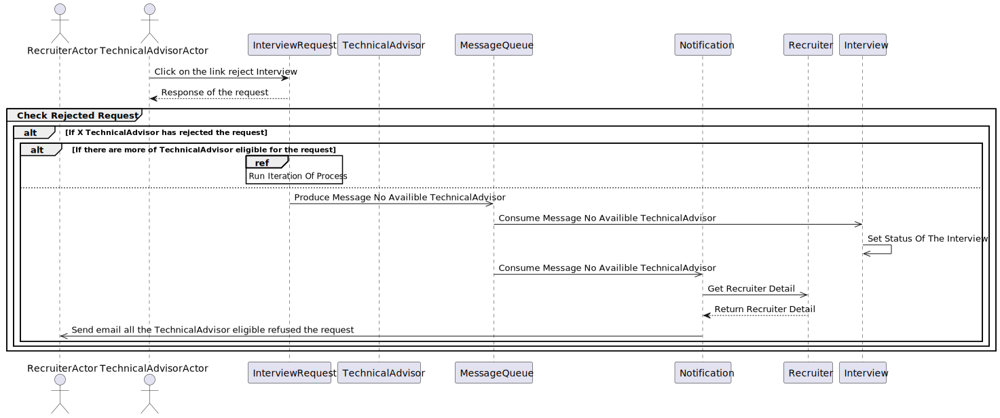
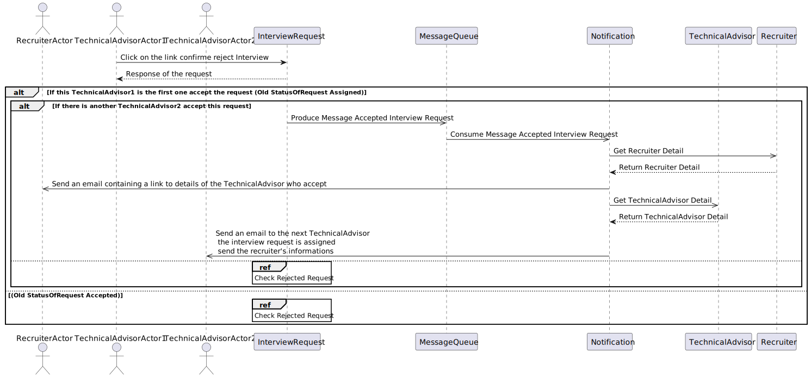
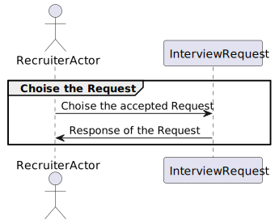

# Interview Managment System
Functional need for a tool related to the management of interviews requested by recruiters from technical experts.

- [Interview Managment System](#interview-managment-system)
- [Conception : C4 Model Diagrams](#conception--c4-model-diagrams)
  - [Core Diagrams](#core-diagrams)
    - [System Context Diagram](#system-context-diagram)
    - [Container Diagram](#container-diagram)
    - [Component Diagram](#component-diagram)
    - [Deployment Diagram](#deployment-diagram)
  - [Supplementary Diagrams](#supplementary-diagrams)
    - [Class Diagram](#class-diagram)
    - [Sequance Diagram](#sequance-diagram)
      - [Sequance Diagram create interview](#sequance-diagram-create-interview)
      - [Sequance Diagram notification technical advisor](#sequance-diagram-notification-technical-advisor)
      - [Sequance Diagram accept interview](#sequance-diagram-accept-interview)
      - [Sequance Diagram reject interview](#sequance-diagram-reject-interview)
      - [Sequance Diagram reject interview after accept](#sequance-diagram-reject-interview-after-accept)
      - [Sequance Diagram confirme reject interview after accept](#sequance-diagram-confirme-reject-interview-after-accept)
      - [Sequance Diagram decline acceptance](#sequance-diagram-decline-acceptance)
      - [Sequance Diagram choise accepted request](#sequance-diagram-choise-accepted-request)

# Conception : C4 Model Diagrams
## Core Diagrams
### System Context Diagram
Source: [1-C4_context_diagram.puml](documents/1-architecture/1-C4_context_diagram.puml)

### Container Diagram
Source: [2-C4_container_diagram.puml](documents/1-architecture/2-C4_container_diagram.puml)

### Component Diagram
Source: [3-C4_component_diagram.puml](documents/1-architecture/3-C4_component_diagram.puml)

### Deployment Diagram
Source: [4-C4_deployment_diagram.puml](documents/1-architecture/4-C4_component_diagram.puml)

## Supplementary Diagrams
### Class Diagram
Source: [1-class_diagram.puml](documents/2-class/1-class_diagram.puml)

### Sequance Diagram
#### Sequance Diagram create interview
Source: [1-sequance_diagram_create_interview.puml](documents/3-sequance/1-sequance_diagram_create_interview.puml)

#### Sequance Diagram notification technical advisor
Source: [2-sequance_diagram_notification_technical_advisor.puml](documents/3-sequance/2-sequance_diagram_notification_technical_advisor.puml)

#### Sequance Diagram accept interview
Source: [3-sequance_diagram_accept_interview.puml](documents/3-sequance/3-sequance_diagram_accept_interview.puml)

#### Sequance Diagram reject interview
Source: [4-sequance_diagram_reject_interview.puml](documents/3-sequance/4-sequance_diagram_reject_interview.puml)

#### Sequance Diagram reject interview after accept
Source: [5-sequance_diagram_reject_interview_after_accept.puml](documents/3-sequance/5-sequance_diagram_reject_interview_after_accept.puml)

#### Sequance Diagram confirme reject interview after accept
Source: [6-sequance_diagram_confirme_reject_interview_after_accept.puml](documents/3-sequance/6-sequance_diagram_confirme_reject_interview_after_accept.puml)

#### Sequance Diagram decline acceptance
Source: [7-sequance_diagram_decline_acceptance.puml](documents/3-sequance/7-sequance_diagram_decline_acceptance.puml)

#### Sequance Diagram choise accepted request
Source: [8-sequance_diagram_choise_accepted_request.puml](documents/3-sequance/8-sequance_diagram_choise_accepted_request.puml)

